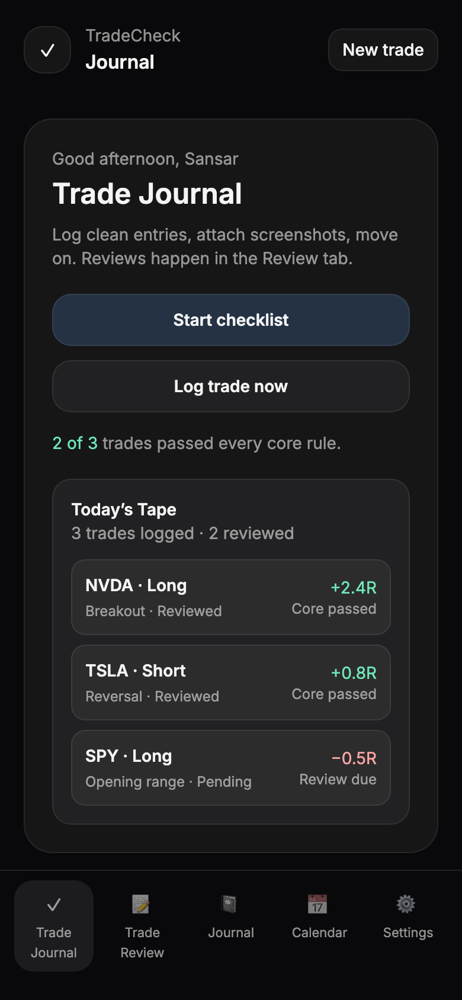
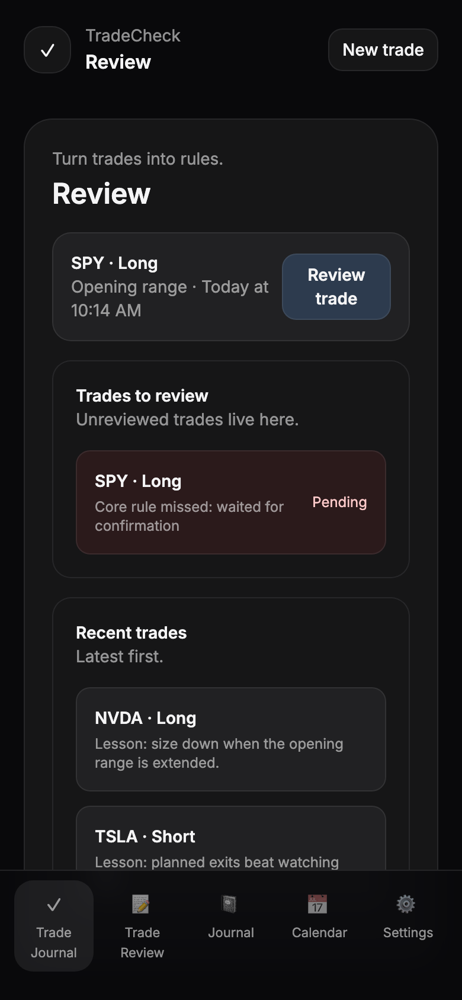

# TradeCheck

An offline-first trading journal PWA that makes review part of the trade.

[Open the app](https://sansar-karki.github.io/TradeCheck/) · [Read the case study](https://sansarkarki.com/case-study/tradecheck)

  
  

## Why I built it

Most trading journals record entries and exits but do little to change the next decision. TradeCheck links the workflow together: complete a pre-trade checklist, log the trade, review the previous decision, and leave one concrete lesson.

## Product loop

- Run a strategy-specific checklist before entering a trade.
- Attach screenshots and capture the reasoning while it is fresh.
- Block another entry when a previous trade still needs review.
- Turn reviews into short lessons and daily journal prompts.
- See rule adherence and activity on a calendar without making P&L the only score.

## Built with

- Vanilla HTML, JavaScript, and Tailwind CSS
- Supabase authentication and state storage
- Local caching and background sync for offline use
- A service worker and web app manifest for installation

## Status

Paused after product testing. The product worked, but I did not find enough differentiation from established trading journals to justify expanding a standalone app. Stopping was part of the product decision, not an unfinished engineering task.

## Repository map

| File | Purpose |
| --- | --- |
| `index.html` | Single-page application and interface |
| `sw.js` | Offline caching and update behavior |
| `manifest.webmanifest` | Installable PWA metadata |
| `icons/` | Application icons |
